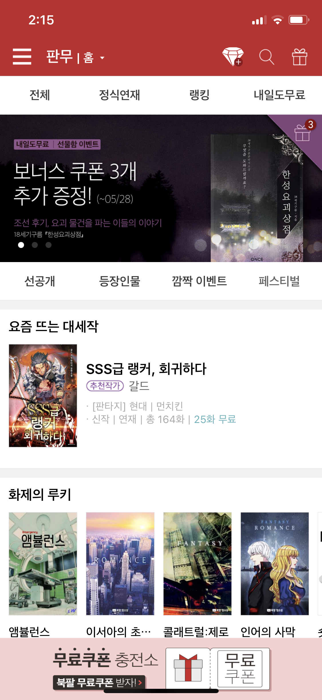

Blog : [http://ideveloper.tistory.com](http://ideveloper.tistory.com)

facebook: [https://www.facebook.com/byungjo.hwang](https://www.facebook.com/byungjo.hwang)

Github: [https://github.com/HwangByungJo](https://github.com/HwangByungJo)

## 경력

[북팔](https://novel.bookpal.co.kr/)

- 2015/11/02 ~

[우리앱](http://wooriap.com)

- 2015/08 ~ 2015/09 

[푸드앤텔레콤] 

- 2015/02 ~ 2015/05

   

[현원소프트]

- 2014/01 ~ 2015/01

[인티그램]

- 2011/05 ~ 2013/06

## 프로젝트

### 북팔웹소설

웹소설앱, 내책장, 마이포켓 (내책장2)

- 소속 : 북팔
- 역할 : iOS 앱 개발
- 사용기술 : iOS, Realm, FCM 
- [AppStore](https://itunes.apple.com/kr/app/%EB%B6%81%ED%8C%94-%EC%9B%B9%EC%86%8C%EC%84%A4/id898129838?mt=8)

     

### 북팔판타지

웹소설앱, 내책장

- 소속 : 북팔
- 역할 : iOS 앱 개발
- 사용기술 : iOS, Realm, FCM 
- [AppStore](https://itunes.apple.com/kr/app/%EB%B6%81%ED%8C%94%ED%8C%90%ED%83%80%EC%A7%80/id1094115877?mt=8)

     

### 8Talk for Telegram

텔레그램 오픈소스을 이용, 채팅 방 분류 탭, 스티커, 채널 관련 탭 추가

- 소속: 북팔
- 역할: iOS 앱 개발
- 사용기술: iOS
- [AppStore](https://itunes.apple.com/kr/app/8talk-for-telegram/id1237423645?mt=8)

### Kaffa

제품소개, 레시피, 샘플신청 기능

- 소속 : 현원소프트
- 역할 : iOS 앱 개발
- 사용기술 : iOS
- [AppStore](https://itunes.apple.com/kr/app/kaffa/id724295322?mt=8)

    

### Skylife

스카이라이프 편성표 제공, 예약녹화 기능 

* 소속 : 현원소프트
* 역할: iOS 앱 개발 
* 사용기술 : iOS
* 서비스종료

 

### 올레펍

분야별로 선호하는 매거진 콘텐츠를 편리하게 구독 및 공유 할수 있는 서비스

- 소속 : 인티그램
- 역할 : iOS 앱 개발
- 사용기술 : iOS
- 서비스 종료

     

### 올레펍 에디터

개인이 글과 사진 등을 간편하게 편집해 매거진으로 출판하고
소셜네트워크서비스(SNS)를 통해 공유할 수 있는 서비스

- 소속 : 인티그램
- 역할 : iOS 앱 개발
- 사용기술 : iOS
- 서비스 종료

    
