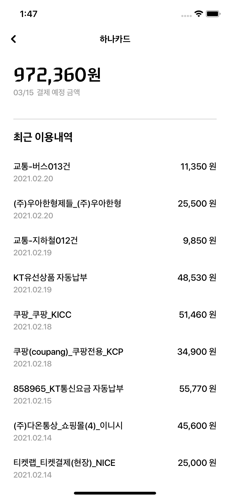
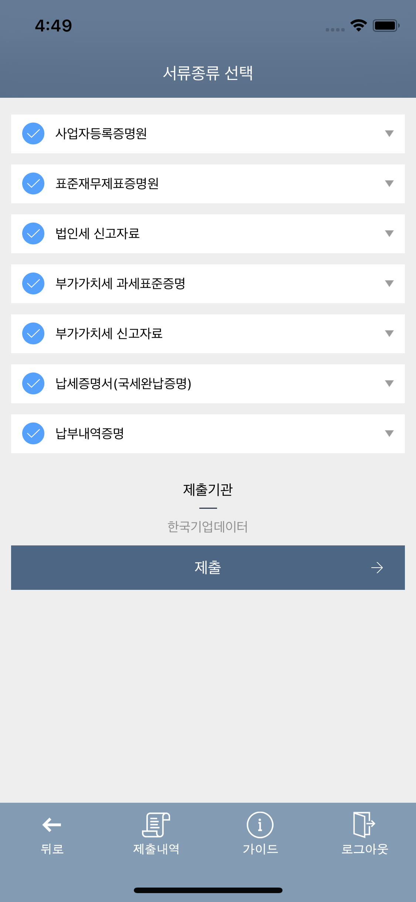
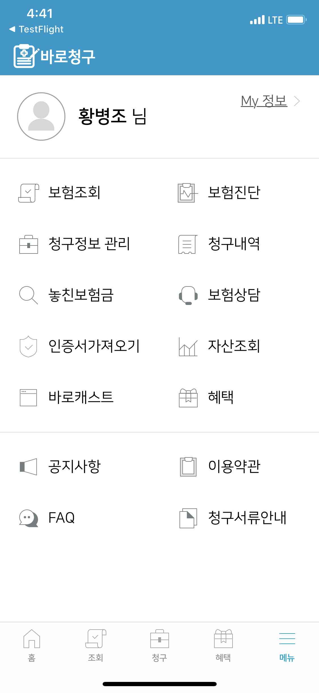
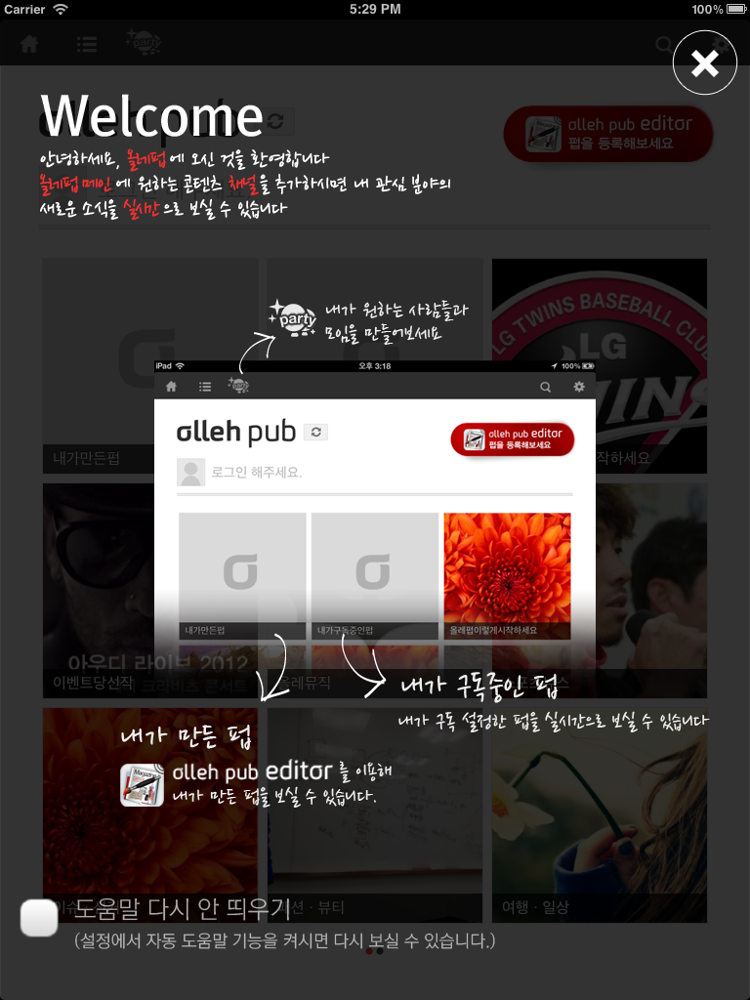

## 경력

[기웅정보통신](http://www.kwic.co.kr/)

- 2018/07/02 ~ 재직중

[북팔](https://novel.bookpal.co.kr/)

- 2015/11/02 ~ 2018/05/31

[우리앱](http://wooriap.com)

- 2015/08 ~ 2015/09 

[푸드앤텔레콤](http://food-n.co.kr/)

- 2015/02 ~ 2015/05

   

[현원소프트]

- 2014/01 ~ 2015/01

[인티그램]

- 2011/05 ~ 2013/06

## 프로젝트

### 스크래핑 엔진 개발

- 소속: 기웅정보통신
- 역할 : 스크래핑 엔진 개발 
- 사용기술 : Objective-C

### 현대카드, 현대캐피탈 (자산관리 메뉴)

현다카드, 현대캐피탈 앱

- 소속 : 기웅정보통신
- 역할 : 기웅솔루션인 스크래핑 모듈을 사용하여 현대카드, 현대캐피탈 자산관리 메뉴 개발 (iOS)
- 사용기술 : Swift (현대카드) Objective-c (현대 캐피탈)
- [AppStore](https://apps.apple.com/kr/app/%ED%98%84%EB%8C%80%EC%B9%B4%EB%93%9C/id702653088)   

        

### 퀵파인드

 국세청 홈택스 및 민원24 등에서 발급가능한 고객증명서 및 기업의 현장사진을 금융기관 및 공공기관에 스마트폰을 이용하여 비대면으로 실시간 제출하는 핀테크 서비스입니다.
 
- 소속 : 기웅정보통신
- 역할 : iOS 앱 유지보수
- 사용기술 : Objective-C
- [AppStore](https://itunes.apple.com/kr/app/%ED%80%B5%ED%8C%8C%EC%9D%B8%EB%93%9C/id1111949185?mt=8)

    

### 바로청구 

 내보험 다보여 조회기능, 보험사 상세 정보 조회기능, 청구서 전송

- 소속 : 기웅정보통신
- 역할 : iOS 앱 유지보수
- 사용기술 : Swift, Realm, FCM, 
- [AppStore](https://itunes.apple.com/kr/app/%EC%8B%A4%EC%86%90%EB%B3%B4%ED%97%98-%EB%B0%94%EB%A1%9C%EC%B2%AD%EA%B5%AC/id1296713322?mt=8)

  

### 북팔웹소설  (Universal)

 웹소설앱, 웹소설 뷰어, 내책장(회차 다운로드)

- 소속 : 북팔
- 역할 : iOS 앱 개발
- 사용기술 : Objective-C, Realm, FCM 
- [AppStore](https://itunes.apple.com/kr/app/%EB%B6%81%ED%8C%94-%EC%9B%B9%EC%86%8C%EC%84%A4/id898129838?mt=8)

     

### 북팔판타지  (Universal)

웹소설앱, 웹소설 뷰어, 내책장(회차 다운로드)

- 소속 : 북팔
- 역할 : iOS 앱 개발
- 사용기술 : Objective-C, Realm, FCM 
- [AppStore](https://itunes.apple.com/kr/app/%EB%B6%81%ED%8C%94%ED%8C%90%ED%83%80%EC%A7%80/id1094115877?mt=8)

     

### 8Talk for Telegram  (Universal)

텔레그램 오픈소스을 이용, 채팅 방 분류 탭, 스티커, 채널 관련 탭 추가

- 소속: 북팔
- 역할: iOS 앱 개발
- 사용기술: Objective-C
- [AppStore](https://itunes.apple.com/kr/app/8talk-for-telegram/id1237423645?mt=8)

 

### Kaffa (Universal)

제품소개, 레시피, 샘플신청 기능

- 소속 : 현원소프트
- 역할 : iOS 앱 개발
- 사용기술 : Objective-C
- [AppStore](https://itunes.apple.com/kr/app/kaffa/id724295322?mt=8)

    

### Skylife (iPhone, iPad)

스카이라이프 편성표 제공, 예약녹화 기능 

- 소속 : 현원소프트
- 역할: iOS 앱 개발 
- 사용기술 : Objective-C

#### iPad
     

#### iPhone
  

### 아너소사이어티 (iPhone, iPad)

- 소속 : 인티그램
- 역할 : iOS 앱 개발, 유지보수
- 사용기술 : Objective-C

#### iPad
   

#### iPhone
    

### B2Y (iPhone, iPad)

- 소속 : 인티그램
- 역할 : iOS 앱 개발, 유지보수
- 사용기술 : Objective-C

#### iPad
    

#### iPhone
   

### 올레펍 (iPhone, iPad)

분야별로 선호하는 매거진 콘텐츠를 편리하게 구독 및 공유 할수 있는 서비스

- 소속 : 인티그램
- 역할 : iOS 앱 개발, 유지보수
- 사용기술 : Objective-C

#### iPhone
         

#### iPad
     

### 올레펍 에디터 (iPhone, iPad)

개인이 글과 사진 등을 간편하게 편집해 매거진으로 출판하고
소셜네트워크서비스(SNS)를 통해 공유할 수 있는 서비스

- 소속 : 인티그램
- 역할 : iOS 앱 개발, 유지보수
- 사용기술 : Objective-C

#### iPhone
   

#### iPad
        
